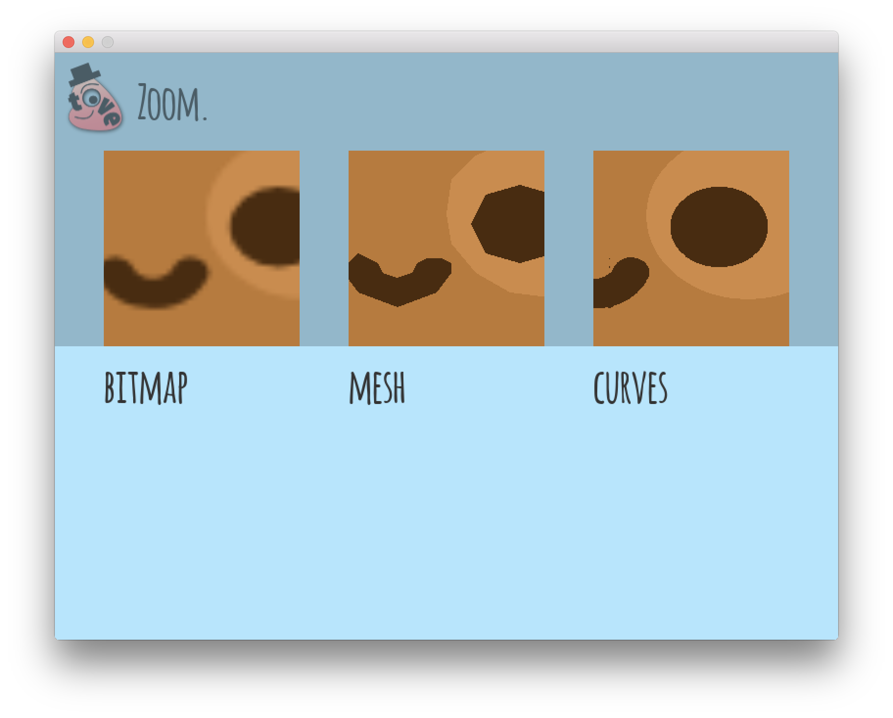
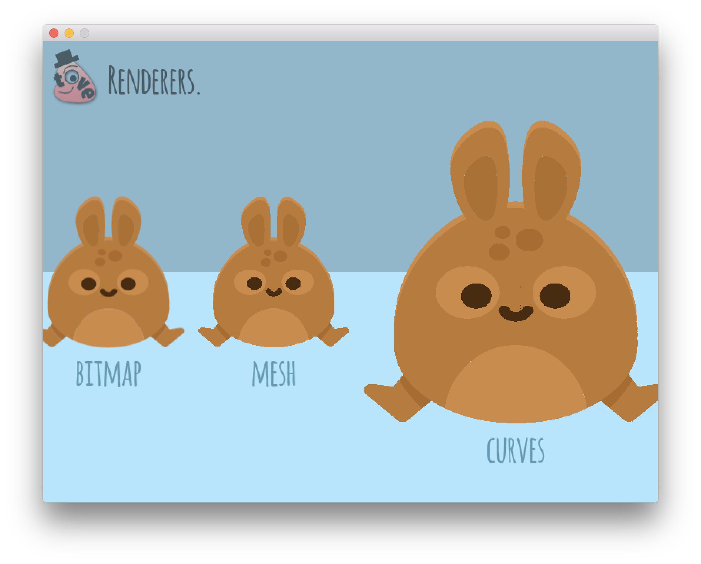
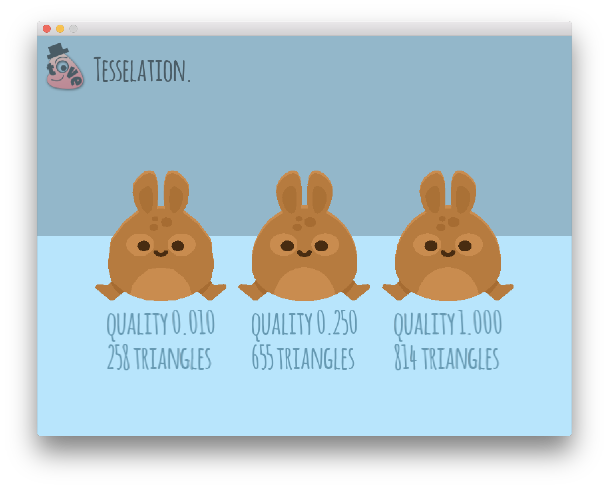
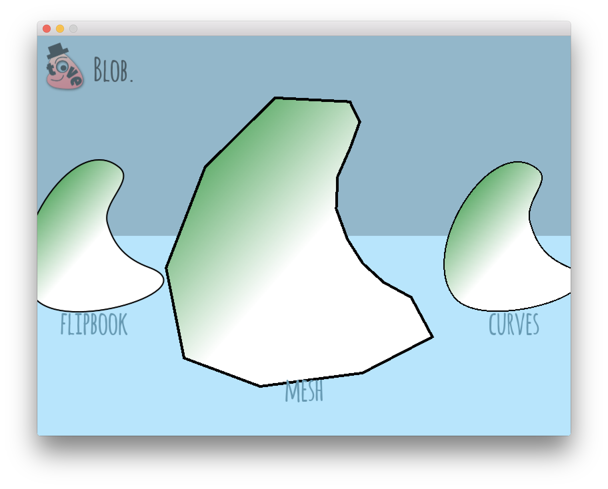
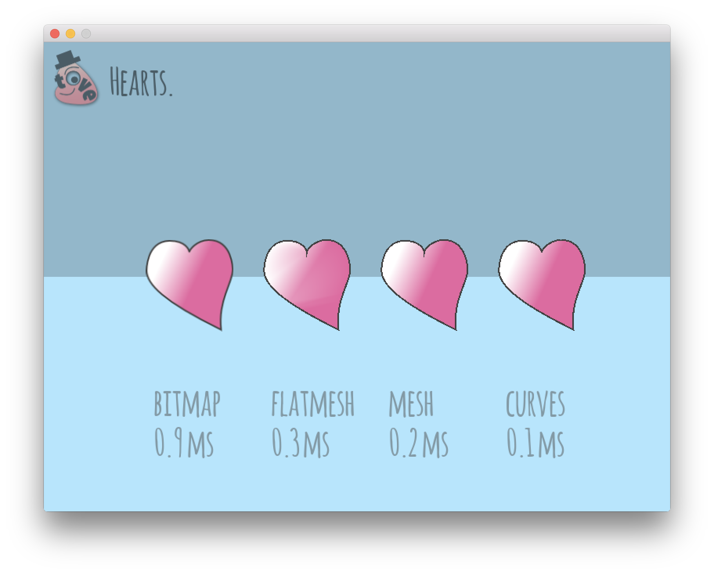
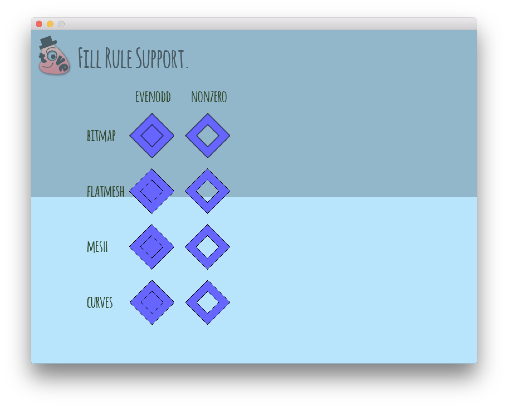

# The Demos
You might wonder at this point, what you gain with TÖVE over simply rasterizing your vector graphics to textures via an export step from your vector drawing software. It's flexibility.

Let's take a quick look at some of [TÖVE's demos](https://github.com/poke1024/tove2d/tree/master/demos), as they explain a lot about the core ideas and capabilities of TÖVE.

## Running the Demos

Check out the whole repo from GitHub. To run the demos, the `lib` and `assets` folders need to be accessible from inside the demos.

On macOS and Linux, the demos contain symbolic links, and all you need to do is to unzip TÖVE's lib into the repo's root like this:

- demos
- docs
- lib
  - libTove.dylib
  - ...
- LICENSE
- ...

Then you can start one demo, e.g. the `zoom` demo, using:

```
cd demos/zoom
love .
```

On Windows, the symbolic links don't work :-( So you need to unzip the `lib` into each demo folder. Also you need to copy the `demos/assets` folder inside the respective demo folder. Basically: replace the symlinks with the real stuff.

## MiniEdit Demo
TÖVE comes with a mini editor that lets you explore all of TÖVE's features (different renderers and settings) interactively. You can drag and drop SVGs into the editor. It also has a demo mode that lets you benchmark performance:


## Zoom Demo
Scaling bitmaps produces blurriness or pixelation, scaling meshes produces straight crisp lines, while TÖVE's unique shader-based `curves` renderer will render crisp curves at many reasonable scales:



## Renderers Demo
Interactively zoom TÖVE's three renderers to inspect the quality:



## Tesselation Demo
The `mesh` renderer's quality setting produces meshes of different detail and triangle count from the same SVG:



## Blob Demo
Animate between two SVGs using different renderers and qualities:



The SVGs have been exported as animation from one single timeline from Smith Micro Moho. As Moho uses one underlying geometry for all exported frame (defined on frame 1 in the timeline), all SVGs share the same path and point layout, which allows for interpolation in TÖVE.

## Hearts Demo
Procedurally animate geometry and colors (here: a linear gradient) through different renderers:



The numbers displayed are times spent inside `love.graphics.draw` (might not be representative as more work might happen later in the  swap of the GL context).

The `mesh` and `curves` renderers update existing GPU data structures like meshes and shader textures without recreating them, which allows for higher frame rates.

This demo also illustrates why the `flatmesh` renderer is called as it's called: you see that it's not able to handle gradients very well.

## Fill Rule Demo
TÖVE offers support for holes and fill rules for all of its renderers:




