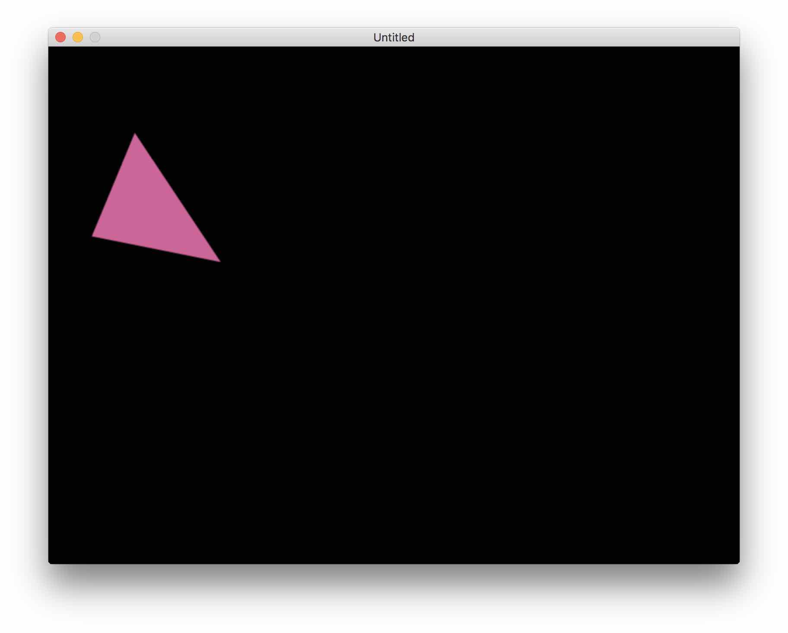
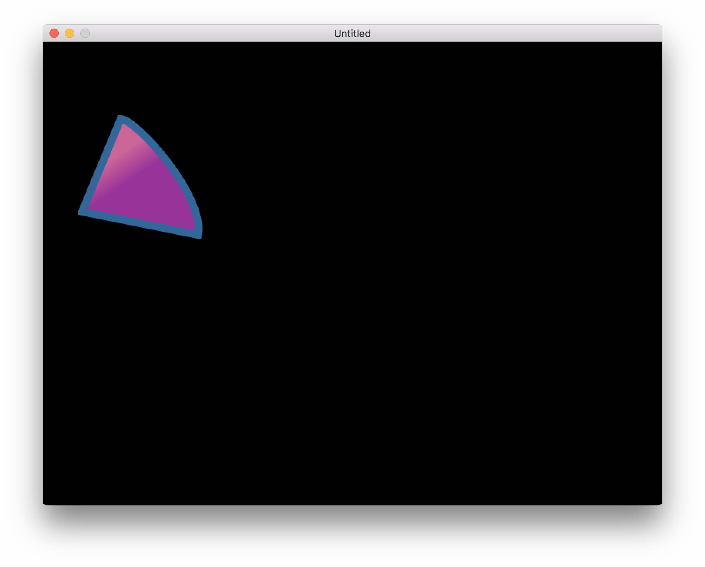
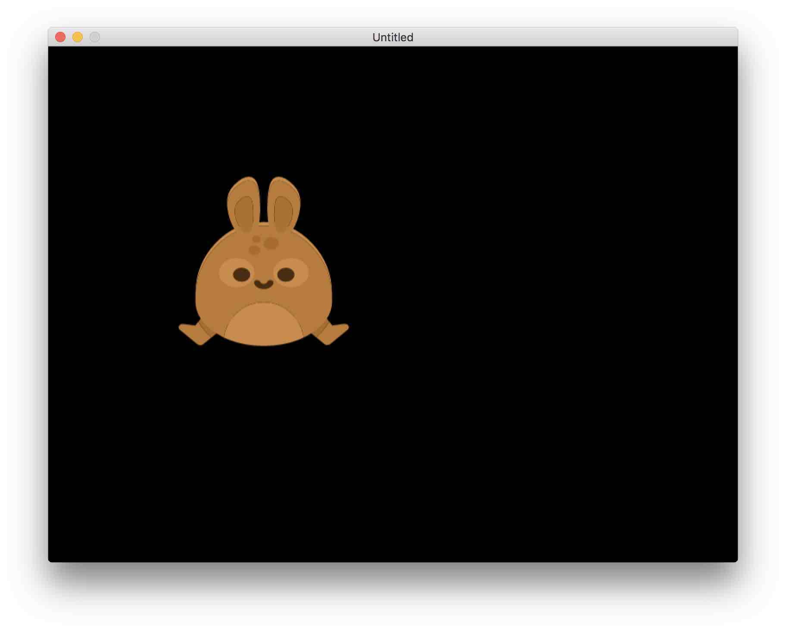

# Getting Started
Some info to get you started.

## Installation
To install TÖVE, grab TÖVE's [`binaries`](https://github.com/poke1024/tove2d/releases/download/1.0/tove.zip) package and unzip it inside your LÖVE project (as a folder called `tove`). You should then be able to load TÖVE using `tove = require "tove"`.

TÖVE's folder contains four files:

- `init.lua`: a Lua library binding to love
- `libTove.dll`: TÖVE library (for Windows)
- `libTove.dylib`: TÖVE library (for macOS)
- `libTove.so`: TÖVE library (for Linux)

Since you're running only on one platform, you'd only need one of the binary files, but they are all included for convenience.

## Drawing a Triangle
Let's draw a triangle.

First import TÖVE as described above. Then create a `Graphics` instance, which is the main API for drawing in TÖVE:

```
local tove = require "tove"
local myDrawing = tove.newGraphics()
```

 `Graphics` provides various functions of drawing and works similar to a canvas. Here comes our triangle:

```
myDrawing:moveTo(100, 100)
myDrawing:lineTo(200, 250)
myDrawing:lineTo(50, 220)
myDrawing:fill()
```

`moveTo` moves your drawing brush to an absolute position. `lineTo` then draws two lines. `fill` finally tells TÖVE to close the shape (i.e. supplement the missing third line) and fill it (with the current fill color).

To see what we've drawn, we need to display the `Graphics`instance to the screen like this:

```
function love.draw()
	myDrawing:draw()
end
```

Now you should see the image below; note that the coordinates you put into the `moveTo` and `lineTo` earlier correspond to the position of the triangle on LÖVE screen.


Wow, very impressive, no?

Ok, you could indeed add some color by calling `setFillColor` before doing the `fill`:

```
myDrawing:setFillColor(0.8, 0.4, 0.6)
myDrawing:fill()
```



Note: `setFillColor`  can take RGBA values, but you can also specify HTML colors , e.g. `setFillColor(#80AA20)`.

At this point, you might wonder what TÖVE is about. All this can be done with LÖVE as well. So on to the next section:

## Curves, lines and gradients
While TÖVE supports straight lines, curves are its real matter. Let's bend one side of our triangle by replacing the first `lineTo` from above with a `curveTo`, which will draw a cubic bezier curve:

```
myDrawing:moveTo(100, 100)
myDrawing:curveTo(120, 100, 210, 200, 200, 250)
myDrawing:lineTo(50, 220)
myDrawing:setFillColor(0.8, 0.4, 0.6)
myDrawing:fill()
```


`curveTo` takes the positions of two control points (x1, y1, x2, y2) and one target point (x, y).  Together with the previous starting point this makes four points to define the cubic bezier curve.

This is a good place to note that you can also use `drawCircle(x, y, r)`  and `drawEllipse(x, y, rx, ry)` to draw circles and ellipses, and `drawRect(x, y, w, h, rx, ry)` to draw (rounded) rectangles.

Let's continue with our triangle. Adding a bluish stroke of line width 10 is as simple as appending this code:

```
myDrawing:setLineColor(0.2, 0.4, 0.6)
myDrawing:setLineWidth(10)
myDrawing:stroke()
```


Now, instead of a solid purple fill, let's use a linear gradient to make things more interesting:

```
local gradient = tove.newLinearGradient(120, 130, 140, 160)
gradient:addColorStop(0, 0.8, 0.4, 0.6)
gradient:addColorStop(1, 0.6, 0.2, 0.6)
myDrawing:setFillColor(gradient)
myDrawing:fill()
```



## Importing SVGs
Yes, you can import SVGs, and it's as simple as this:

```
local rabbit = love.filesystem.read("assets/rabbit.svg")
local myRabbit = tove.newGraphics(rabbit, 200)

function love.draw()
	love.graphics.translate(250, 250)
	myRabbit:draw()
end
```

The call to `newGraphics` takes the actual SVG data that was loaded via `love.filesystem.read`. The optional second parameter, `200`,  tells TÖVE to prescale the graphics to 200 pixels. If this is omitted, the SVG's natural scaling will be used, which assumes you know its exact scaling.



Note that after loading the SVG, TÖVE no longer cares whether it's dealing with an SVG or a manually constructed graphics (meaning you can change the renderer and so on).
