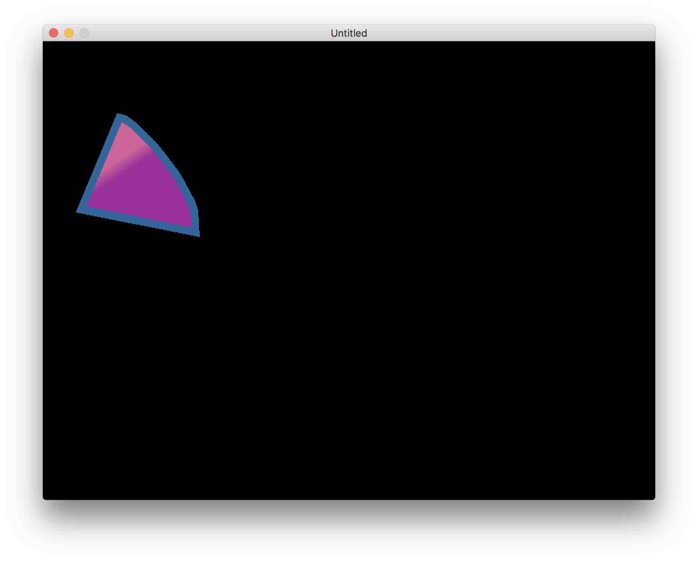
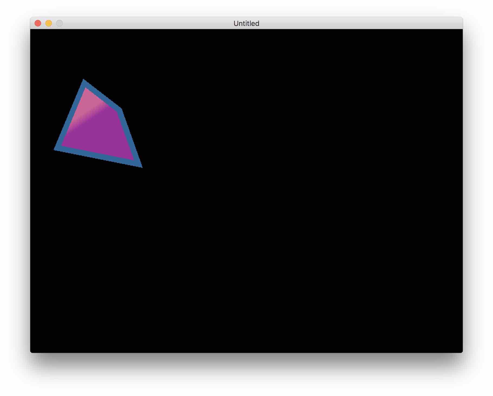

# Setting Renderers
This section should give you some idea of why there are three different renderers in TÖVE, what they do, and when you want to change things. This extends on the information given in the <a href="https://poke1024.github.io/tove2d-api/modules/display.html">API documentation on display modes</a>.

##  The renderers
TÖVE provides three renderers to bring vector graphics to the screen: `texture`, `mesh` and `gpux`:

* `texture` is the default renderer. It gives high quality and high performance for static images that don't need animation or scaling. Internally, this is NanoSVG rendering to a texture.
*  `mesh` uses a triangle mesh to produce a tessellated version of the graphics, which is then drawn using a <a href="https://love2d.org/wiki/Mesh">LÖVE Mesh</a>. Scaling will not produce pixelation, but crisp straight edges. Using this renderer,  curves and colors can be animated efficiently.
* `gpux` is a purely shader-based renderer that gives high quality at different resolutions. It's a very complex shader and quite experimental (it's not been done before AFAIK). It allows for efficient animation of curves and colors.

You can tell TÖVE which renderer to use by calling `Graphics:setDisplay(mode, quality...)` on your `Graphics` instance, e.g. `myDrawing:setDisplay("mesh")`. The next call to `Graphics:draw()` will then honor that setting. The optional `quality` parameter is a render-dependent number that allows you to configure the level of detail for some renderers.

Let's try this out. With the curved triangle from the Getting Started section, let's set a mesh renderer before drawing:

```
 myDrawing:setDisplay("mesh")

function love.draw()
	myDrawing:draw()
end
```



You might notice that the bottom right edge looks a bit edgy now. That's due to the mesh's default quality setting. To see that we're really dealing with a mesh, let's increase that effect by telling TÖVE to use even less triangles:

```
 myDrawing:setDisplay("mesh", 100) -- specify the target resolution in pixels to define tesselation detail
```



One of the strengths of TÖVE is that choosing the display renderer is independent of building your geometry and colors.

##  Which renderer is right for me?
Here are some hints:

`texture` gives great quality, but is slow for re-rendering and scaling via transforms will produce pixelation, unless you re-render for a higher resolution. You can tell TÖVE at which resolution to render internally by using <a href="https://poke1024.github.io/tove2d-api/classes/Graphics.html#Graphics:setResolution">`Graphics:setResolution`</a> (this won't affect the display size, but you'll see that a resolution of `2` will allow you to scale the image by a factor of 2 without seeing pixelation).

`mesh` is the best all-round solution if you need to dynamically scale your graphics. Once you determine a detail level that matches your requirements (in terms of scaling and zoom), you're basically dealing with a <a href="https://love2d.org/wiki/Mesh">LÖVE Mesh</a>, which is efficient to draw, scale and animate.

`gpux` can give excellent results in terms of quality and performance in some situations. Then again, it can be  expensive in terms of shader performance and there can be issues with numerical stability [^1].

## Setting the mesh renderer quality
If you're using the `"mesh"` display mode, the quality setting in <a href="https://poke1024.github.io/tove2d-api/classes/Graphics.html#Graphics:setDisplay">`Graphics:setDisplay`</a> lets you change the level of the detail the mesh renderer tessellates its mesh. In most cases, you should specify a tesselation using `"adaptive"` or `"rigid"`. For example `Graphics:setDisplay("mesh", "adaptive", 1024)` will render a mesh that should look good
when drawn at a size of 1024 pixels.

TÖVE allows a second option, where you only specify a single number, e.g. `Graphics:setDisplay("mesh", 1024)`. In that case, TÖVE will look at the mesh's usage (see <a href="https://poke1024.github.io/tove2d-api/classes/Graphics.html#Graphics:setUsage">Graphics:setUsage</a>) and come up with a suitable tesselator. If your usage is `static`, TÖVE will create a `"adaptive"` tesselator, if your usage is `dynamic` or `stream`, the tesselator will be `"rigid"`.

The second factor to mention here is <a href="https://poke1024.github.io/tove2d-api/classes/Graphics.html#Graphics:setResolution">`Graphics:setResolution`</a>. If you specified a quality of `1024`, but also set a resolution of `2`, you will in fact get a quality that's good for 2048 pixels.

## Mesh renderer quality and MSAA

By default the mesh renderer looks rather pixelated. You can fix this by increasing the MSAA settings of your window like this (see <a href="https://love2d.org/wiki/Config_Files">Love2D docs on config files</a>):

```
function love.conf(t)
	t.window.msaa = 2
end
```

Thanks to pdesaulniers for <a href="https://github.com/poke1024/tove2d/issues/31">reporting this</a>.


## The mesh renderer and gradients
The mesh renderer automatically detects if you are using gradients or not. If not, it internally uses a flat mesh of vertices and colors. If you use gradients, it will use a shader implementation for the coloring.

[^1]: computing cubic roots in a shader using 16 bit floating point numbers might not only seem potty but indeed has some limits.
